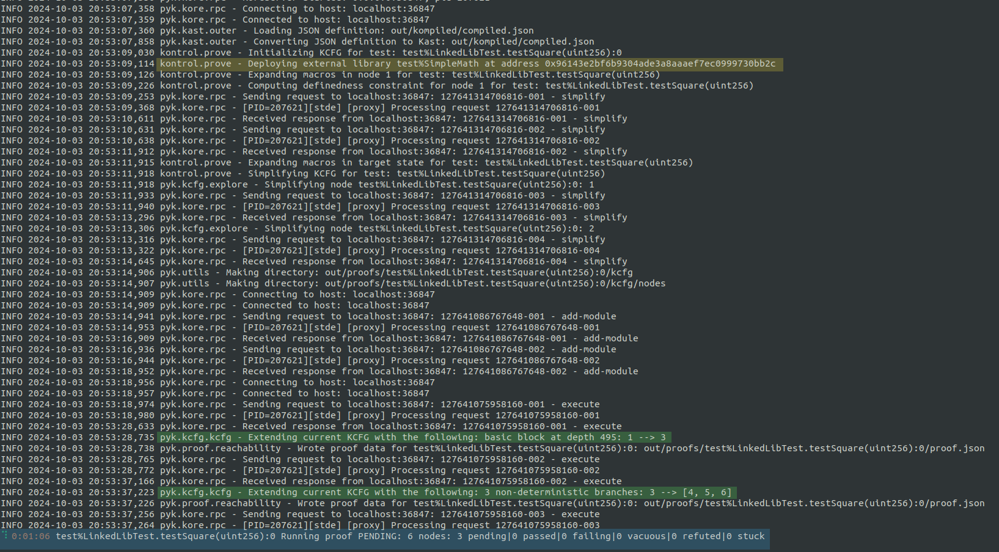
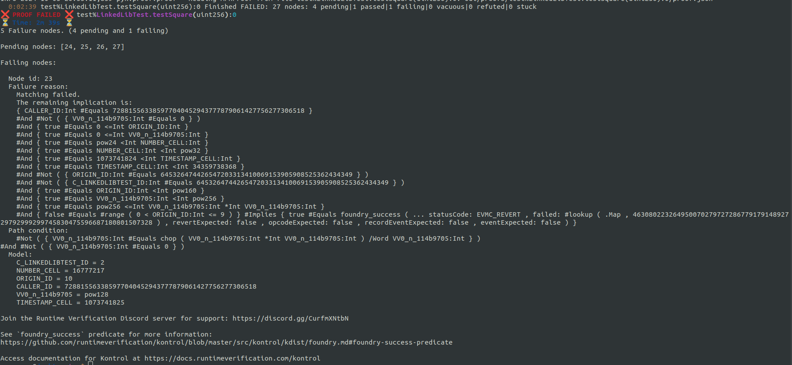
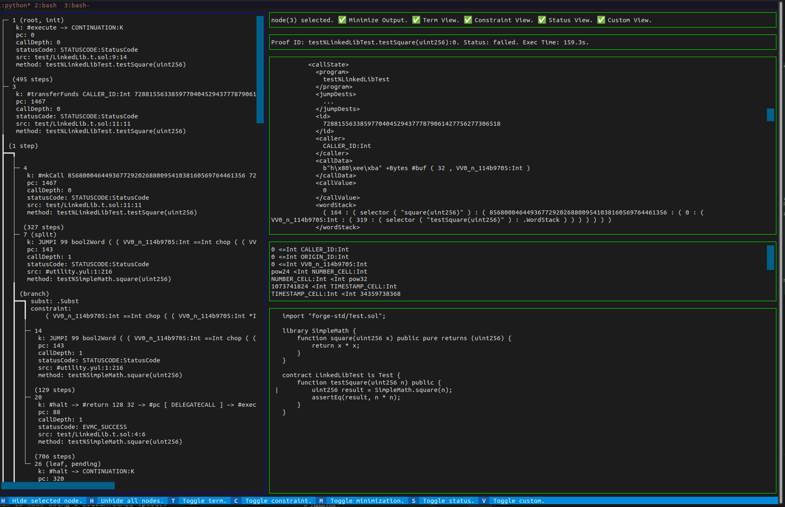
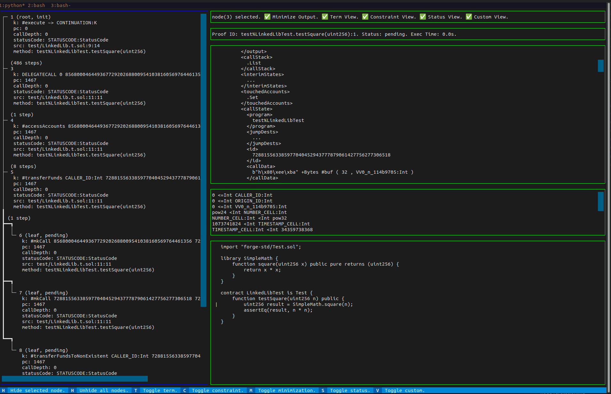
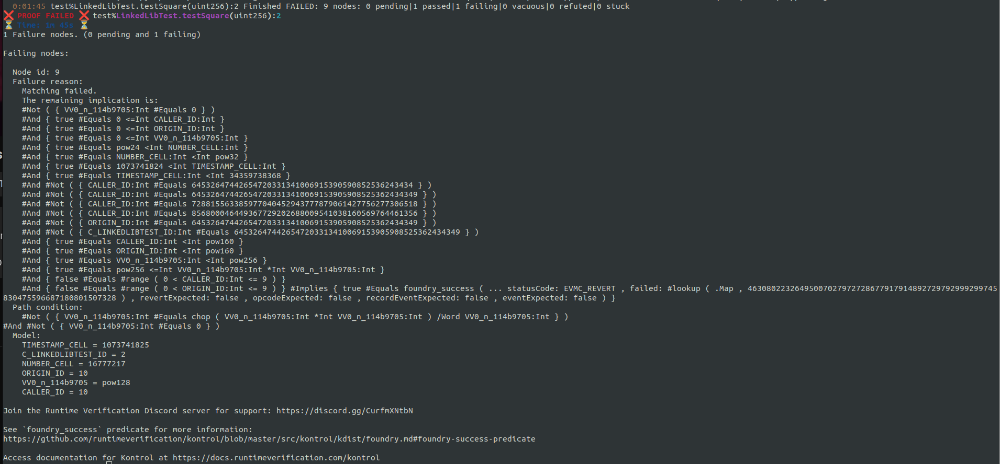

# Running proofs with linked libraries

A solidity library is a collection of functions that other contracts can call.
If you're unfamiliar with libraries, we strongly recommend checking the [official documentation](https://docs.soliditylang.org/en/latest/contracts.html#libraries).
An important note to mention is that if a library only has internal or private functions, it is considered an embedded library, and it will be deployed with the contract that uses it.
However, suppose a library has at least one external or public function.
In that case, the generated bytecode of the contract will have a placeholder like `__$30bbc0abd4d6364515865950d3e0d10953$__` as the compiler does not know where the library will be deployed.
Kontrol and Forge will handle this step automatically when running tests using linked libraries.

Now, let's set up a Kontrol project and run some proofs!

First, let's set up a new project using `kontrol init`.
Next, we can create a new file under `test/LinkedLibTest.t.sol` with the following code.

```sol

import "forge-std/Test.sol";

library SimpleMath {
    function square(uint256 x) public pure returns (uint256) {
        return x * x;
    }
}

contract LinkedLibTest is Test {
    function testSquare(uint256 n) public {
        uint256 result = SimpleMath.square(n);
        assertEq(result, n * n);
    }
}
```
For this example, we will use a library with a single function that computes the square of a number.

Let's have a look at the test to see what happens.
First, we run `kontrol build` to prepare the proofs for execution.
Next, we run `kontrol prove --mt LinkedLibTest.testSquare --verbose`.
We use `--verbose` to quickly identify issues in real-time.
The output may seem overwhelming initially, but that's what this tutorial is here for.

<figure><figcaption><p>Verbose output of kontrol prove</p></figcaption></figure>

First, highlighted in blue, you can see the proof's live status.
This shows the time elapsed, the proof's name, its status, and a summary of the control flow graph.

You can see the new address where the linked library is deployed, which is highlighted in yellow.

Highlighted in green, you can see when the KCFG is extended with one or multiple nodes.
The second message, `Extending current KCFG with the following: 3 non-deterministic branches: 3 --> [4,5,6]`, tells us that the prover discovered three possible states to which the execution of node 3 can lead.

Shortly after seeing these messages, the proof fails with something similar to the screenshot below.

<figure><figcaption><p>output of a failing proof</p></figcaption></figure>

Let's look closer at the 3-way non-deterministic branching we noticed during the proof execution.
We can open the kontrol Terminal User Interface with `kontrol view-kcfg LinkedLibTest.testSquare`.

We should see something like this after selecting node number 3 from the left panel.

<figure><figcaption><p>Kontrol_TUI_0</p></figcaption></figure>

In the bottom right corner, we see that the source map points to the `uint256 result = SimpleMath.square(n);` instruction.

In addition, we can see that the internal rule, marked with `k:` at which the node was `cut` is `#transferFunds CALLER_ID: Int 728815563385977040452943777879061427756277306518 0`.
`#transferFunds` is an internal step that the evm-semantics applies during calls.
At this point, our intuition tells us that the execution branches when the machine tries to send `0` funds from a symbolic address named CALLER_ID to the `728815563385977040452943777879061427756277306518` address.


Why is there a symbolic `CALLER_ID`? 
After all, the `LinkedLibTest` contract calls the `SimpleMath.square(uint256)` function, so the address used should be the contract's address.

Let's rerun the proof with `kontrol prove --mt LinkedLibTest.testSquare --verbose --reinit --break-on-calls`.
We already know the proof is failing, so let's stop the process as soon as the 3-way branch is detected.

Notice that in the proof's live status, the version has increased to 1.
We can inspect the new KCFG using `kontrol view-kcfg LinkedLibTest.testSquare --version 1`.

<figure><figcaption><p>Kontrol_TUI_1</p></figcaption></figure>

In this version, we notice two additional notes before the branching occurs.
Additionally, we can see that the call to `SimpleMath.square` is made using a `DELEGATECALL` opcode.
The use of `DELEGATECALL` is also confirmed by the official documentation, which states:

> ... code is reused using the DELEGATECALL (CALLCODE until Homestead) feature of the EVM. This means that if library functions are called, their code is executed in the context of the calling contract, ...

'CALLER_ID' is the address used to call the `LinkedLibTest.testSquare` test function in the test contract.
This explains why the symbolic `CALLER_ID` is used to call the linked library function.
The branching takes place because the prover considers every case for which the `CALLER_ID` could be one of the addresses present in the network state.

So, what can we do?

We need to determine if the caller to the library could affect the execution of the call.
In our current case, the outcome of the `SimpleMath.square` shouldn't differ depending on the test's initial caller.
We can introduce new preconditions for `CALLER_ID` using `vm. assume` before the `SimpleMath.square(uint256)` call.

We can assume that `CALLER_ID` is different than any address in the `<network>` state.

``` sol
vm.assume(msg.sender != address(64532647442654720331341006915390590852536243434));
vm.assume(msg.sender != address(728815563385977040452943777879061427756277306518));
vm.assume(msg.sender != address(856800046449367729202688009541038160569764461356));
```

...or we can assume that `CALLER_ID` is equals to a concrete address.

```sol
vm.assume(msg.sender == address(0xc0ffee));
```

Let's go with the first approach, updating the test function to:

```sol
function testSquare(uint256 n) public {
    vm.assume(msg.sender != address(64532647442654720331341006915390590852536243434));
    vm.assume(msg.sender != address(728815563385977040452943777879061427756277306518));
    vm.assume(msg.sender != address(856800046449367729202688009541038160569764461356));
    uint256 result = SimpleMath.square(n);
    assertEq(result, n * n);
}
```

Next, we must rebuild the project with `kontrol build --regen --rekompile`.
With this approach, we preserve the previous proof executions.
Now let's run the new test with `kontrol prove --mt LinkedLibTest.testSquare --reinit`.

The proof still fails, but we see only one pending node and one failing node.
There is one more branch that takes place.

We could inspect the kcfg once more to see what the control flow graph looks like now, but that is optional, as the information we need right now is also present in the final output of Kontrol.

<figure><figcaption><p>Kontrol_TUI_2</p></figcaption></figure>

The output summarizes the first failure identified while running the proof.
We determine if a node represents a failure based on multiple conditions, such as a revert status code or a failed assertion.
[You can learn more about the success predicate here](https://github.com/runtimeverification/kontrol/blob/master/src/kontrol/kdist/foundry.md#foundry-success-predicate).
It has three components: the failure reason, the path condition, and the model.
The output shows that the status code is EVMC_REVERT.

Let's focus on the path condition for a bit.
We can see that it is a conjunction of two negated conditions:
    1 `.#Not ( { VV0_n_114b9705:Int #Equals chop ( VV0_n_114b9705:Int *Int VV0_n_114b9705:Int ) /Word VV0_n_114b9705:Int } )`
    2. `#Not ( { VV0_n_114b9705:Int #Equals 0 } )`

The second one is pretty straightforward, asserting that the symbolic argument `VV0_n_114b9705`, is non-zero.
For the first one, we can simplify the variable name to obtain `#Not( n #Equals chop (n *Int n /Word n))`.
Let's break it apart:
- `chop()` is an internal function that ensures that it's argument is lower than `2^256`.
Think about it as a (`_%_`) mod operation.
- In the K language, operators also take the sort on which they are applied.
  `*Int` represents the product of two unbounded integers.

The equation above is equivalent to `( n != (n * n / n) mod type(uint256).max)` which looks more like an overflow check.
And that's what it actually represents, it is a compiler inserted check for the operation inside the `square` function.
So, the proof will lead to an overflow that will throw a revert whenever n is not 0 and n is not equal to `((n * n / n) mod type(uint256).max)`.

The model also gives as a counter-example value from `n`, under `VV0_n_114b9705 = pow128`.
In Solidity, to avoid overflow when squarring a number, the result must stay within the `uint256` range, which has a maximum value of `2^256 - 1`.
The largest number you can safely square is `n=2^128 - 1` which is the maximum value for a `uint128` (i.e., `type(uint128).max`).
This comes from the fact that `n^2` must be less than `2^256`. Taking the square root of `2^256` gives `2^128`, meaning any number `>= 2^128` would overflow.

Now, we can avoid this branch by adding a new precondition using

```sol
vm.assume(n <= type(uint128).max);
```
