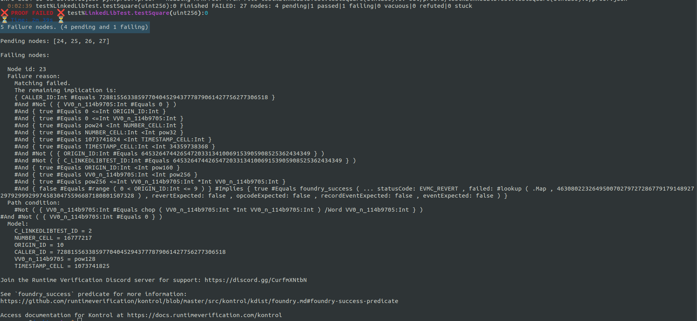
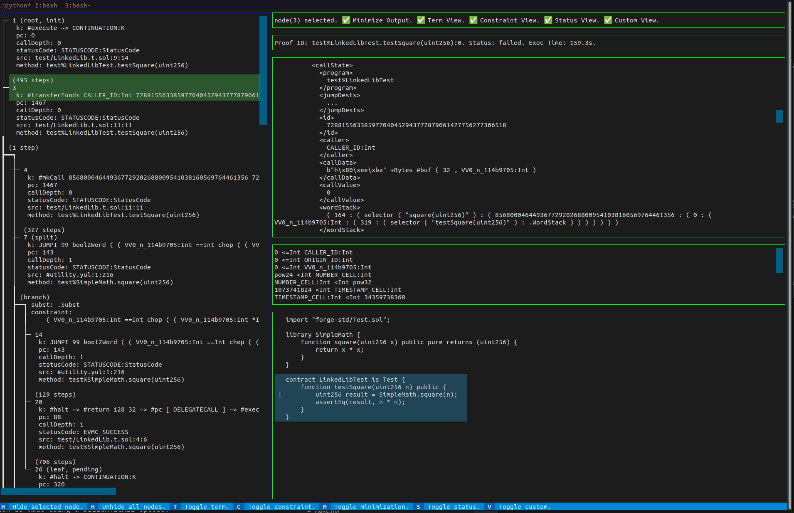

# Running proofs with linked libraries

In Solidity, a library is a collection of functions that other contracts can call.
If you're unfamiliar with libraries, we strongly recommend checking the [official documentation](https://docs.soliditylang.org/en/latest/contracts.html#libraries).
An important note is that if a library only has internal or private functions, it is considered an embedded library and will be deployed with the contract that uses it.
However, if a library has at least one external or public function, it needs to be deployed independently of the contract.
Additionally, the generated bytecode of the contract that uses this library will have a placeholder like `__$30bbc0abd4d6364515865950d3e0d10953$__` in place of the library address, as the compiler does not know where the library will be deployed.
The new Kontrol release and Forge automatically deploy the libraries and link them to the test contract when executing tests involving linked libraries.

Now, let's set up a Kontrol project and run some proofs!

First, ensure you have the latest Kontrol version and set up a new project using `kontrol init`.
Next, we can create a new file under `test/LinkedLibTest.t.sol` with the following code.

```sol

import "forge-std/Test.sol";

library SimpleMath {
    function square(uint256 x) public pure returns (uint256) {
        return x * x;
    }
}

contract LinkedLibTest is Test {
    function testSquare(uint256 n) public {
        uint256 result = SimpleMath.square(n);
        assertEq(result, n * n);
    }
}
```
For this example, we will use a library with a single function that computes the square of a number.

Let's have a look at the test to see what happens.
First, we run `kontrol build` to prepare the proofs for execution.
Next, we run `kontrol prove --mt LinkedLibTest.testSquare --verbose`.
We use `--verbose` to get detailed logs, allowing us to quickly identify and troubleshoot issues in real-time.
The output may seem overwhelming initially, but that's what this tutorial is here for.

<figure><figcaption><p>Verbose output of kontrol prove</p></figcaption></figure>

First, highlighted in blue, you can see the proof's live status.
This shows the time elapsed, the proof's name, its status, and a summary of the control flow graph.

You can see the new address where the linked library is deployed, which is highlighted in yellow.

Highlighted in green, you can see when the KCFG is extended with one or multiple nodes.
The second message, `Extending current KCFG with the following: 3 non-deterministic branches: 3 --> [4,5,6]`, tells us that the prover discovered three possible states to which the execution of node 3 can lead.

Shortly after seeing these messages, the proof fails with the message shown in the screenshot below.

<figure><figcaption><p>output of a failing proof</p></figcaption></figure>

Towards the top of the output, we see the message `5 Failure nods. (4 pending and 1 failing)`.
By default, Kontrol uses the fail-fast strategy, stopping the execution when it is confident that a node has reached a failing state.
The `4 pending` nodes represent execution paths that Kontrol has not explored yet.

Let's set aside the output for now and look closer at the 3-way non-deterministic branching we noticed during the proof execution.
We can view the proof's CFG in the Kontrol Terminal User Interface with `kontrol view-kcfg LinkedLibTest.testSquare`.

Once the interface has loaded, you can select the third node from the left panel.
Now, your interface should look like in the screenshot below.

<figure><figcaption><p>Kontrol_TUI_0</p></figcaption></figure>

In the bottom right corner, we see that the source map points to the `uint256 result = SimpleMath.square(n);` line.

In addition, we can see that the internal rule, marked with `k:` at which the node was `cut` is `#transferFunds CALLER_ID: Int 728815563385977040452943777879061427756277306518 0`.
This is partially displayed in the node information, highlighted in green in the screenshot above.
The complete rule is displayed in the configuration loaded in the upper right tab.
The `#transferFunds` rule represents an internal step that the EVM semantics apply during a call, explicitly handling the transfer of Ether between accounts.
At this point, our intuition tells us that the execution branches when the machine tries to send `0` funds from a symbolic address named `CALLER_ID` to the `728815563385977040452943777879061427756277306518` address.
This branching occurs because the prover considers every possible scenario regarding the transfer, even when no funds are involved.


Why is there a symbolic `CALLER_ID`?
After all, the `LinkedLibTest` contract calls the `SimpleMath.square(uint256)` function, so the address used should be the contract's address.

Let's rerun the proof with `kontrol prove --mt LinkedLibTest.testSquare --verbose --reinit --break-on-calls`.
Here, `--reinit` would ensure that we are re-running the proof from the very beginning, and `--break-on-calls` will add a node to a KCFG every time a call instruction is encountered.
We already know the proof is failing, so let's stop the process as soon as the 3-way branch is detected.

Notice that in the proof's live status, the version has increased to 1.
We can inspect the new KCFG using `kontrol view-kcfg LinkedLibTest.testSquare --version 1`.

<figure><figcaption><p>Kontrol_TUI_1</p></figcaption></figure>

In this version, we notice two additional nodes before the branching occurs.
Additionally, we can see that the call to `SimpleMath.square` is made using a `DELEGATECALL` opcode.
The use of `DELEGATECALL` is also confirmed by the official documentation, which states:

> ... code is reused using the DELEGATECALL (CALLCODE until Homestead) feature of the EVM. This means that if library functions are called, their code is executed in the context of the calling contract, ...

The symbolic `CALLER_ID` represents the address used by Kontrol to initiate the proof and to invoke the `LinkedLibTest.testSquare` function in the test contract.
Since the library function is accessed using `DELEGATECALL`, the same symbolic caller is used.
The branching occurs because the prover evaluates all possible scenarios where:
 1. `CALLER_ID` matches one of the addresses present in the network state.
 2. `CALLER_ID` it is distinct from any of the existing accounts.

So, what can we do?

We need to determine if the caller to the library could affect the execution of the call.
In our current case, the outcome of the `SimpleMath.square` shouldn't differ depending on the test's initial caller.
We can introduce new preconditions for `CALLER_ID` using `vm.assume` before the `SimpleMath.square(uint256)` call.

For example, we can assume that `CALLER_ID` is different than any address in the `<network>` state.

``` sol
vm.assume(msg.sender != address(728815563385977040452943777879061427756277306518));
vm.assume(msg.sender != address(856800046449367729202688009541038160569764461356));
```

...or we can assume that `CALLER_ID` is equals to a concrete address.

```sol
vm.assume(msg.sender == address(0xc0ffee));
```

Let's go with the first approach, updating the test function to:

```sol
function testSquare(uint256 n) public {
    vm.assume(msg.sender != address(728815563385977040452943777879061427756277306518));
    vm.assume(msg.sender != address(856800046449367729202688009541038160569764461356));

    uint256 result = SimpleMath.square(n);
    assertEq(result, n * n);
}
```

> An important note is that, by default, Kontrol automatically adds a few preconditions on the symbolic addresses used: `CALLER_ID`, `ORIGIN_ID`, and any new address generated by the `kevm.freshAddress()` cheat code.
These include the symbolic address not being precompiled nor the address of the cheat-code interface, which is `64532647442654720331341006915390590852536243434`.
> You can always see the path constraints of the symbolic variables by inspecting the middle tab on the right-hand side of the TUI.

Next, we must rebuild the project with `kontrol build --regen --rekompile`.
With this approach, we preserve the previous proof executions, but update the definition of the project we are analyzing.
Now let's run the new test with `kontrol prove --mt LinkedLibTest.testSquare --reinit`.

The proof still fails, but we see only one pending node and one failing node.
In addition to this, the three-way branching no longer takes place.
The three posibilities that the prover found were:
 1. `CALLER_ID` is `728815563385977040452943777879061427756277306518`
 2. `CALLER_ID` is `856800046449367729202688009541038160569764461356`
 3. `CALLER_ID` is not a known address from the network state.

However, we need to investigate one more branching to determine why the proof is failing.

We could inspect the KCFG once more to see what the control flow graph looks like now, but that is optional, as the information we need right now is also present in the final output of Kontrol.

<figure><figcaption><p>Kontrol_TUI_2</p></figcaption></figure>

The output summarizes the first failure identified while running the proof.
We determine if a node represents a failure based on multiple conditions, such as a revert status code or a failed assertion.
[You can learn more about the success predicate used in Kontrol here](https://github.com/runtimeverification/kontrol/blob/master/src/kontrol/kdist/foundry.md#foundry-success-predicate).
It has three components: the failure reason, the path condition, and the model.
The output shows that the status code is EVMC_REVERT, indicating that the execution of the test reverted in at least one branch.

Let's focus on the path condition first.
We can see that it is a conjunction of two negated conditions:
    1. `#Not ( { VV0_n_114b9705:Int #Equals chop ( VV0_n_114b9705:Int *Int VV0_n_114b9705:Int ) /Word VV0_n_114b9705:Int } )`
    2. `#Not ( { VV0_n_114b9705:Int #Equals 0 } )`

The second condition is straightforward; it asserts that the symbolic argument `VV0_n_114b9705` (a K representation of `uint256 n`) is non-zero.

The first condition can be simplified by renaming the variable, resulting in `#Not( n #Equals chop (n *Int n /Word n))`.
To break this down further:
- `chop()` is an internal function that ensures its argument is less than `2^256`.
Essentially, it functions like a modulus operation (`%`).
- In the K language, operators also include the sort on which they operate.
For example, `*Int` represents the product of two unbounded integers, and `/Word` represents the division of two 32 bytes EVM words.

The equation above is equivalent to `n != (n * n / n) mod pow128` which looks more like an overflow check.
And that's what it actually is: a compiler-inserted overflow check for the operation inside the `square` function.
In other words, the proof will run into an overflow and revert if `n` is neither `0` nor equal `to ((n * n / n) % pow128)`.

The model also demonstrates `VV0_n_114b9705 = pow128` as a counter-example--the value that `n` should take for the failure to occur.
In Solidity, to avoid overflow when squaring a number, the result must stay within the `uint256` range, which has a maximum value of `2^256 - 1`.
The largest number you can safely square is `n=2^128 - 1` which is the maximum value for a `uint128` (i.e., `type(uint128).max`).
This is because `n^2` must be less than `2^256`.
The square root of `2^256` is `2^128`, meaning any number greater than or equal to `2^128` would cause an overflow.

Now, we can avoid this branch by adding a new precondition using:

```sol
vm.assume(n <= type(uint128).max);
```
